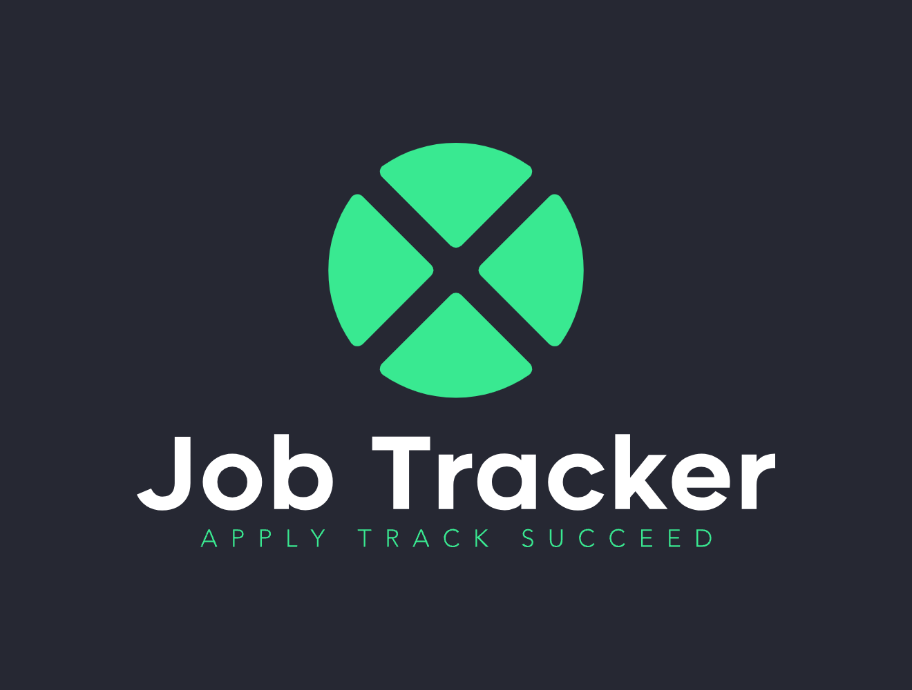

# Job Tracker
This project automates job data collection using an Express server. It scrapes job titles and company names from job posting sites, populates a form with the retrieved data, and then exports the entries to an Excel spreadsheet. Perfect for organizing job search efforts or analyzing job market trends.

## 📦 Technologies:
- [React](https://reactjs.org/)
- [React Testing Libary](https://testing-library.com/)
- [Express](https://expressjs.com/)
- [Material-UI](https://material-ui.com/)
- [Playwright](https://playwright.dev/)
- [Jest](https://jestjs.io/)
- [Vercel](https://vercel.com/) (for hosting frontend & backend)
